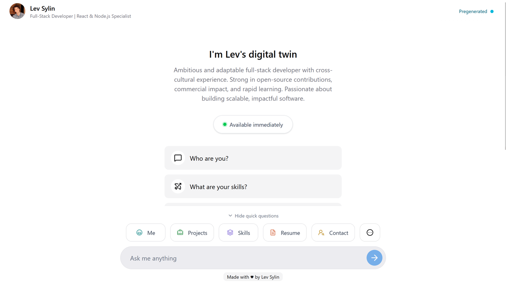

# AI-Agent Portfolio – Effortless, Customizable, Professional

**Create a powerful, modern developer portfolio in minutes — fully customizable through a single JSON file and with a modern AI chat agent look.**  
No coding knowledge required. Just configure, deploy, and showcase your best self.



<p align="center">
  <a href="https://levsylin.com/"></a>
  <a href="docs/LICENSE"></a>
  <a href="https://www.typescriptlang.org/"></a>
  <a href="https://github.com/levosilimo/portfolio-ai-agent/issues"></a>
  <a href="https://github.com/levosilimo/portfolio-ai-agent/stargazers"></a>
</p>

- Fully customizable AI chat, driven by your JSON config.
- Features:
  - Preset questions & responses
  - Dynamic AI replies (Google Gemini API)
  - Mobile optimized
  - Quota management & graceful fallback

---

## ✨ Why Choose This Portfolio?

| Traditional Portfolios              | **This Portfolio**                                 |
| ----------------------------------- | -------------------------------------------------- |
| Tedious manual edits                | **Edit 1 JSON file — instant updates**             |
| Risk of breaking code               | **Zero coding required**                           |
| Complex, hard-to-customize codebase | **Intuitive configuration, AI-powered assistance** |
| Outdated design                     | **Modern, responsive layout**                      |

---

## 🚦 Quick Start (5 Minutes)

<details>
<summary><strong>Step-by-step Setup</strong></summary>

1. **Fork & Clone**

   ```bash
   git clone https://github.com/your-username/portfolio.git
   cd portfolio
   ```

2. **Install Dependencies**

   ```bash
   npm install
   # or
   pnpm install
   # or
   yarn install
   ```

3. **Get a Google Gemini API Key**
   - Visit [Google AI Studio](https://aistudio.google.com/)
   - Sign in, create an API key, and copy it.

4. **Configure Environment**
   - Copy `.env.example` to `.env.local`
   - Add your API key:
     ```
     GOOGLE_GENERATIVE_AI_API_KEY=your_google_ai_api_key_here
     ```

5. **Edit Your Info**
   - Fill `portfolio-config.json` with your information (see below).

6. **Run Locally**

   ```bash
   npm run dev
   ```

   - Visit [http://localhost:3000](http://localhost:3000)

7. **Deploy**

   ```bash
   npm run build
   ```

   - Deploy to Vercel, Netlify, or any platform.

</details>

---

## 🤖 AI-Driven Configuration

**Let AI build your portfolio configuration for you!**

- Upload your resume (PDF/DOC) and the sample `portfolio-config.example.json` to ChatGPT or Claude.
- Use this prompt:
  ```
  Please generate a portfolio-config.json using my resume and this template. Include my experience, skills, projects, and suggested images.
  ```
- Alternatively, manually edit `portfolio-config.json` to customize your info, skills, and projects.

---

## 🗂️ Project Structure

<details>
<summary><strong>View File Structure</strong></summary>

```
portfolio-ai-agent/
├── data/
│   ├── portfolio-config.json # Portfolio configuration
├── public/                # Images & assets
├── src/                   # Source code
│   ├── app/               # Next.js app structure
│   ├── components/        # UI Components
│   ├── config/               # Config loaders & utilities
│   ├── hooks/             # React hooks
│   ├── types/             # TypeScript types
│   └── utils/             # Utilities
├── docs/                  # Documentation
├── package.json           # Project metadata
└── ...
```

</details>

---

## 🖼️ Image & Asset Guidelines

- **Project Screenshots**: `public/chat.jpg` (1200x800px recommended)
- **Favicon**: `public/favicon.ico` (32x32px)
- **External URLs** supported and cached

---

## 🌎 Deployment

**Vercel (Recommended):**  
[](https://vercel.com/new/clone?repository-url=https%3A%2F%2Fgithub.com%2Flevosilimo%2Fportfolio-ai-agent)

**Manual:**

- Push to GitHub
- Import to Vercel/Netlify/Railway
- Set environment variables
- Deploy!

---

## 🆘 Troubleshooting & Support

- **AI Chat not working?** Check your API key and quota.
- **Images missing?** Ensure correct urls and filenames.
- **Build failing?** Validate JSON and run type checks.
- **Need help?**
  - [Open an Issue](https://github.com/levosilimo/portfolio-ai-agent/issues)
  - [Discussions](https://github.com/levosilimo/portfolio-ai-agent/discussions)

---

## 🤝 Contributing

We welcome your contributions!  
Check [open issues](https://github.com/levosilimo/portfolio-ai-agent/issues) to get started.

---

## 📄 License

MIT License — see [LICENSE](docs/LICENSE) for details.

---

<p align="center">
  <b>Made with ❤️ by developers, for developers</b><br>
  <a href="https://github.com/levosilimo/portfolio-ai-agent">⭐ Star on GitHub</a> | <a href="https://github.com/levosilimo/portfolio-ai-agent/issues">🐛 Report Bug</a> | <a href="https://github.com/levosilimo/portfolio-ai-agent/discussions">💬 Request Feature</a>
</p>
